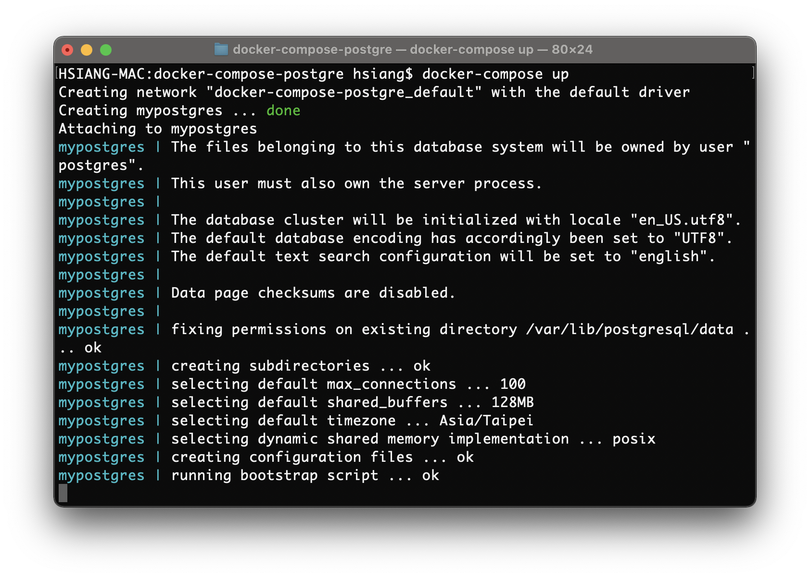

# 利用 docker compose 建置 postgre 資料庫
利用 docker 建置環境，已經算是開發人員的基本日常，以下為利用 docker compose 機制來建置 postgreSQL 資料庫的範例

---
<br />
<br />

## 注意

* 請先準備好 docker , docker-compose 的執行環境
* **範例資料庫帳號密碼：admin/123456**

---
**1. 撰寫 docker-compose.yml 檔案**
```yml
version: '3.1'

services:
  db:
    image: "postgres:10"
    container_name: mypostgres
    restart: always
    environment:
      - POSTGRES_DB=database
      - POSTGRES_USER=admin
      - POSTGRES_PASSWORD=123456
      - TZ=Asia/Taipei
    ports:
      - "5432:5432"
    volumes:
      - ./initdb.d:/docker-entrypoint-initdb.d
      - ./pgdata:/var/lib/postgresql/data
      - ./postgres.conf:/etc/postgresql/postgresql.conf
```

<br />

| 屬性名稱        |屬性範例        | 說明  |
| -------------  | ------------- | ----- |
| container_name | mypostgres         | 非必要，為 Docker Container 的名稱，方便管理 |
| ports          | 5432:5432          | 必要：5432 為連線的 PORT |
| environment    | POSTGRES_DB        | 資料庫資料庫名稱 |
|                | POSTGRES_USER      | 資料庫連線帳號 |
|                | POSTGRES_PASSWORD  | 資料庫連線密碼 |
|                | TZ                 | 資料庫時區 |
| volumes        | ./initdb.d         |  |
|                | ./pgdata           |  |
|                | ./postgres.conf    |  |

<br />
<br />

---

**2. 在 docker-compose.yml 的同一層資料夾下，執行指令**
```sh
$ docker-compose up
```




```console

docker-compose up -d

```
